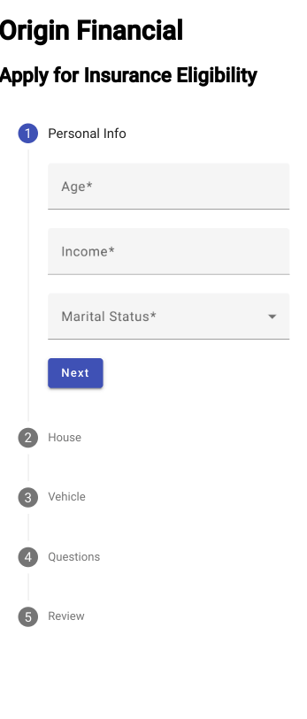
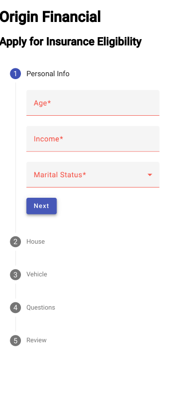
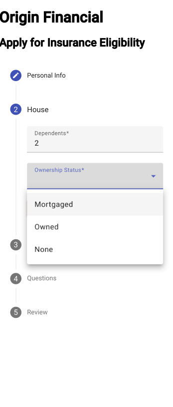
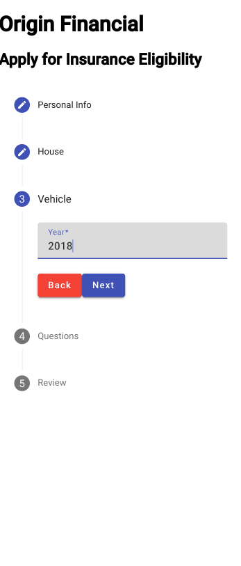
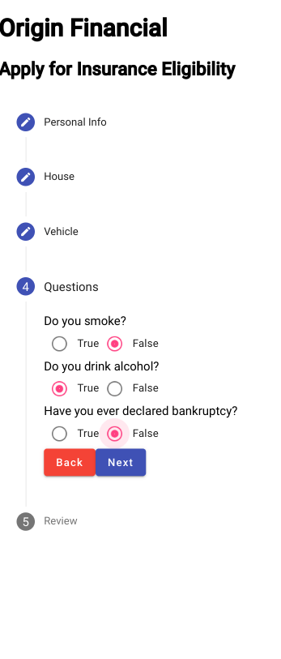
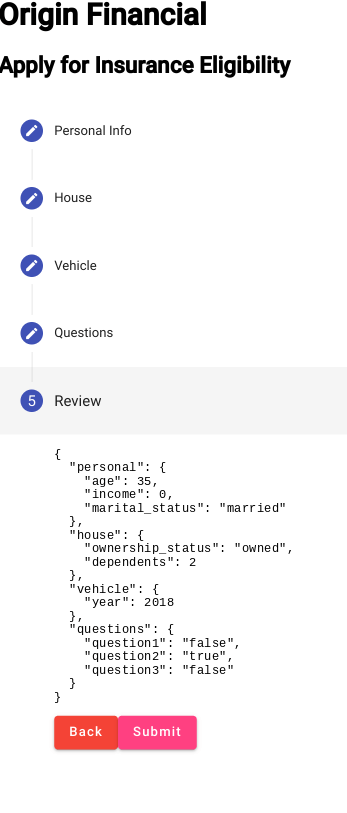
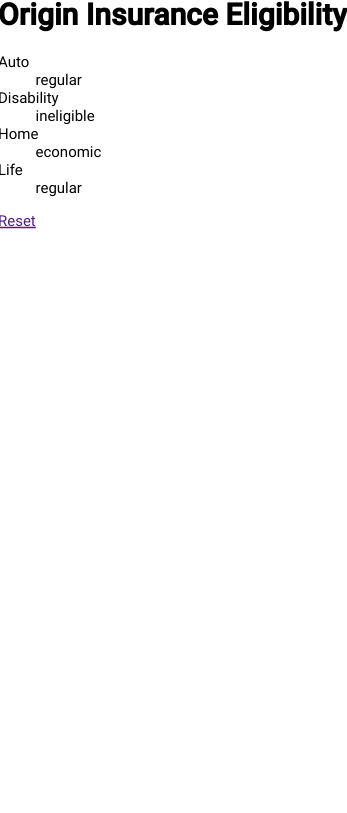

# Origin Angular Frontend

This expands upon this [challenge](https://github.com/OriginFinancial/origin-backend-take-home-assignment) and [my own solution](https://github.com/jdegand/origin-backend-take-home-assignment).

## Screenshots



***



***



***



***



***



***



***

## Tasks

Origin offers its users an insurance package personalized to their specific needs without requiring the user to understand anything about insurance. This allows Origin to act as their *de facto* insurance advisor.

Origin determines the user’s insurance needs by asking personal & risk-related questions and gathering information about the user’s vehicle and house. Using this data, Origin determines their risk profile for **each** line of insurance and then suggests an insurance plan (`"economic"`, `"regular"`, `"responsible"`) corresponding to her risk profile.

For this assignment, you will create a simple version of that application by coding a simple API endpoint that receives a JSON payload with the user information and returns her risk profile (JSON again) – you don’t have to worry about the frontend of the application.

## The input
First, the would-be frontend of this application asks the user for her **personal information**. Then, it lets her add her **house** and **vehicle**. Finally, it asks her to answer 3 binary **risk questions**. The result produces a JSON payload, posted to the application’s API endpoint, like this example:

```JSON
{
  "age": 35,
  "dependents": 2,
  "house": {"ownership_status": "owned"},
  "income": 0,
  "marital_status": "married",
  "risk_questions": [0, 1, 0],
  "vehicle": {"year": 2018}
}
```

### User attributes
All user attributes are required:

- Age (an integer equal or greater than 0).
- The number of dependents (an integer equal or greater than 0).
- Income (an integer equal or greater than 0).
- Marital status (`"single"` or `"married"`).
- Risk answers (an array with 3 booleans).

### House
Users can have 0 or 1 house. When they do, it has just one attribute: `ownership_status`, which can be `"owned"` or `"mortgaged"`.

### Vehicle
Users can have 0 or 1 vehicle. When they do, it has just one attribute: a positive integer corresponding to the `year` it was manufactured.

## The risk algorithm
The application receives the JSON payload through the API endpoint and transforms it into a *risk profile* by calculating a *risk score* for each line of insurance (life, disability, home & auto) based on the information provided by the user.

First, it calculates the *base score* by summing the answers from the risk questions, resulting in a number ranging from 0 to 3. Then, it applies the following rules to determine a *risk score* for each line of insurance.

1. If the user doesn’t have income, vehicles or houses, she is ineligible for disability, auto, and home insurance, respectively.
2. If the user is over 60 years old, she is ineligible for disability and life insurance.
3. If the user is under 30 years old, deduct 2 risk points from all lines of insurance. If she is between 30 and 40 years old, deduct 1.
4. If her income is above $200k, deduct 1 risk point from all lines of insurance. 
5. If the user's house is mortgaged, add 1 risk point to her home score and add 1 risk point to her disability score. 
6. If the user has dependents, add 1 risk point to both the disability and life scores. 
7. If the user is married, add 1 risk point to the life score and remove 1 risk point from disability. 
8. If the user's vehicle was produced in the last 5 years, add 1 risk point to auto score.

This algorithm results in a final score for each line of insurance, which should be processed using the following ranges:

- **0 and below** maps to **“economic”**.
- **1 and 2** maps to **“regular”**.
- **3 and above** maps to **“responsible”**.


## The output
Considering the data provided above, the application should return the following JSON payload:

```JSON
{
    "auto": "regular",
    "disability": "ineligible",
    "home": "economic",
    "life": "regular"
}
```

## Criteria
You can choose any technology stack to implement this assignment. Using our stack is not a requirement in the selection process - we will consider exclusively that you build a solid system with an emphasis on code quality, simplicity, readability, maintainability, and reliability, particularly regarding architecture and testing to evaluate your work.

Be aware that Origin will mainly take into consideration the following evaluation criteria:
* How clean and organized your code is;
* If you implemented the business rules correctly;
* How good your automated tests are (qualitative over quantitative).

Other important notes:
* Develop a extensible score calculation engine
* Add to the README file: (1) instructions to run the code; (2) what were the main technical decisions you made; (3) relevant comments about your project 
* You must use English in your code and also in your docs

This assignment should be doable in less than one day. We expect you to learn fast, **communicate with us**, and make decisions regarding its implementation & scope to achieve the expected results on time.

It is not necessary to build the screens a user would interact with, however, as the API is intended to power a user-facing application, we expect the implementation to be as close as possible to what would be necessary in real-life. Consider another developer would get your project/repository to evolve and implement new features from exactly where you stopped. 

## Built With

- [Angular](https://angular.io/docs)
- [Angular CLI](https://github.com/angular/angular-cli) version 15.2.5.
- [Angular Material](https://material.angular.io/)

## How to Use

The Express application runs by default on `http://localhost:4000` and has the following endpoints:

 - `http://localhost:4000/api/score` - post endpoint that expects the form object - complete the form and the object's shape is shown on the last step.

### Running the Express Backend Application

You can clone my the whole [repo](https://github.com/jdegand/origin-backend-take-home-assignment) and checkout to the angular branch or just clone the angular branch.  

```bash 

git clone https://github.com/jdegand/origin-backend-take-home-assignment.git -b angular --single-branch

# cd into the directory
npm install

npm start
```

### Running the Angular Application

Run the express application first.  Use two terminals.  

```bash

git clone https://github.com/jdegand/origin-angular-frontend.git

# cd into the directory
npm install 

npm start
```

## Thoughts

- Reworked my express backend interfaces and risk calculation function to match the personalInfo object.
- Some properties are now nested so minor tweaks were necessary i.e. personal.income vs income 
- Depending how you want to group categories, you will have to make the necessary adjustments on the backend.
- CORS and its typescript types were added as well.   
- I added router in a limited way.  I only used routes for the home page and results page.
- Instead of showing the api's response in another route, I could have used an ngIf to make the form disappear and show the results in the same component.  
- Passing the api response data to another route gives you a lot of implementation choices. I initially tried setting the data to a variable in the form component and using an Input decorator to get the variable in the response component.  I also thought about subscribing directly in the service and setting a variable in the service and using a function to get the variable's value in the response component. Ulitmately, I used a state object to pass the data to the route during navigation.  Best practices here is tough to determine and as all approaches seem to be equally viable.  But using Input may be less performant.  Subjects also could be considered.  
- I used Angular Material to make the multi-step form.  
- The grouping of the various categories could be different i.e. dependents could go with house or personal.  The risk questions could easily be changed.  I thought about adding various extras like name, address, etc but ultimately, the form has to match the backend so I left it as is.  Extra field could be added and not be factored in to the risk calculation.
- Not a fan of most of the preset Angular Material themes - most of the color combinations are terrible.  
- Desktop version is just the mobile version stretched.

## Continued Development

- Styling tweaks for desktop
- Confirm step rework versus just rendering a json object
- Angular 16 update ?
- Testing
- Problem with form component html -> warnings about incorrect use of form label 

## Useful Resources

- [YouTube](https://www.youtube.com/watch?v=KwQ-N2p0VGc) - Multi Forms in angular with validation | Angular Reactive forms example | Material UI Stepper
- [Stack Overflow](https://stackoverflow.com/questions/46705101/mat-form-field-must-contain-a-matformfieldcontrol) - mat form field must containa mat form field control
- [YouTube](https://www.youtube.com/watch?v=nEuO2iBPceE) - Angular Material Radio button groups and lists - explained with live easy examples
- [Angular Wiki](https://www.angularjswiki.com/httpclient/post/) - httpClient POST
- [Stack Overflow](https://stackoverflow.com/questions/72867495/pass-api-response-from-one-component-to-another-component-in-angular) - pass api response from one component to another component
- [Tek Tutorials Hub](https://www.tektutorialshub.com/angular/angular-pass-data-to-route/#passing-dynamic-data-to-a-route) - passing dynamic data to a route
- [Stack Overflow](https://stackoverflow.com/questions/59670358/angular-8-not-getting-the-state-value-in-required-format-using-routerlink-and-s) - getting the state value
- [Stack Overflow](https://stackoverflow.com/questions/36835123/how-do-i-pass-data-to-angular-routed-components) - pass data to angular routed components
- [In Depth Dev](https://indepth.dev/tutorials/angular/indepth-guide-to-passing-data-via-routing) - indepth guide to passing data via routing
- [Medium](https://medium.com/javascript-everyday/keep-data-in-the-state-object-during-navigation-in-angular-5657af156fb8) - keep data in the state object during navigation
- [Stack Overflow](https://stackoverflow.com/questions/52663044/angular-only-allow-routing-if-routed-using-router-navigate-method) - only allow routing with router navigate
- [Stack Overflow](https://stackoverflow.com/questions/263965/how-can-i-convert-a-string-to-boolean-in-javascript) - convert string to boolean
